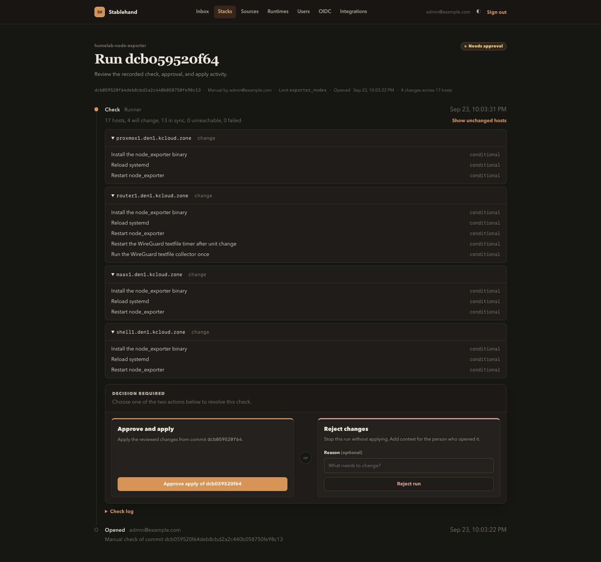
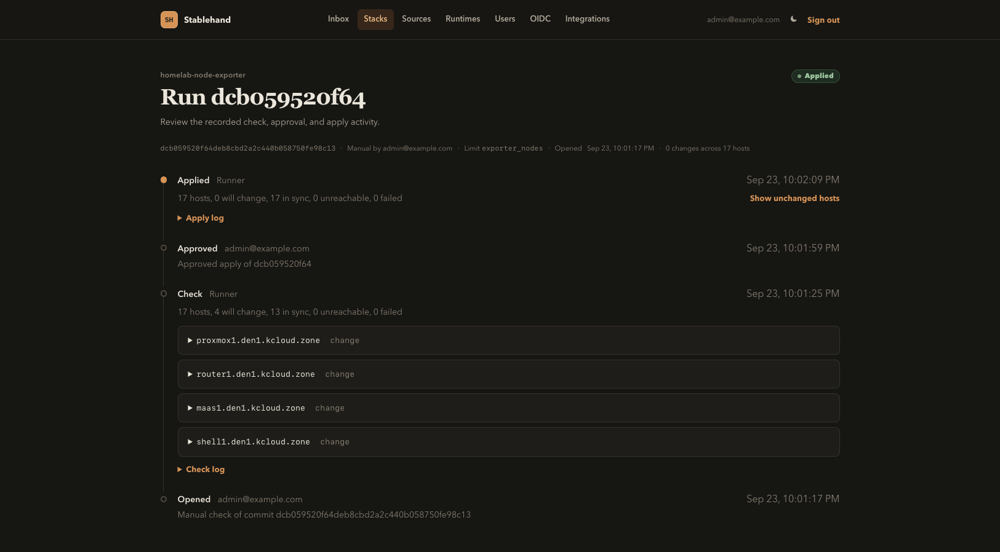
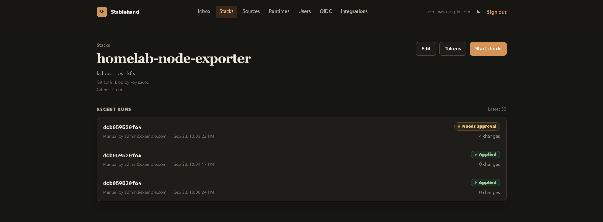

# Stablehand

Stablehand runs a pyinfra check, shows the hosts that would change, and waits for a person to approve that commit before applying it.

## Approve the check



A check is `pyinfra --dry --diff --json` at a pinned commit. The run page lists each host that would change, and the operations behind that change. The inbox collects checks that are waiting for a decision.

The person who opened the run can approve it. When a stack has an approver list, that list still decides who may approve. An empty list means any member. Rejecting a run stops it and can include a reason for the person who opened it.

Approving applies that same commit. Apply repeats the check first. If the change-set fingerprint differs from the approved check, the run returns to needs approval instead of changing hosts.

## The apply stays on the same run



One run, one URL. The timeline keeps the check, the approval, and the apply, with the log for each phase. A stack has one active run. A cron schedule opens a check and waits for approval.

## Stacks



A stack is a deploy file, an inventory, a source, and a runtime.

- A source is a Git repository or a local tree. Git sources can store a deploy key and a default ref, and a stack can pin its own ref.
- A runtime executes locally or as a Kubernetes Job. A Kubernetes runtime mounts a host secret, and runner pods run without a service account token.
- A default host limit narrows the inventory. A CI run inherits that limit when `limit` is omitted, and an empty string targets every host.
- CI tokens (`shc_`) open a run and read its status. Diffs and approval stay in the UI. Run tokens (`shr_`) upload logs and the result for a single phase.

Open a check from CI:

```sh
curl -X POST http://localhost:8000/api/stacks/$STACK_ID/runs \
  -H "Authorization: Bearer $TOKEN" \
  -H "Content-Type: application/json" \
  -d '{"commit": "local", "limit": "web-*, canary"}'
```

The response includes the run id, state, change counts, and URL.

When a check needs approval, webhooks receive that summary: the run URL and change counts. The diff stays in the UI. A signing secret is sent as `X-Stablehand-Signature`, `sha256=` plus the HMAC of the body.

## Run locally

```sh
docker compose up --build
```

Open http://localhost:8000 and sign in as `admin@example.com` / `changeme`. Compose seeds a demo stack for `examples/demo`, which targets `@local`. Start a check from the stack page, then approve it to apply.

Humans sign in with a session cookie. OIDC is optional, and OIDC users stay disabled until an admin enables them.

Kubernetes stacks run `ghcr.io/ianunruh/stablehand:main` as a Job. GitHub Actions publishes that tag from `main`. See [deploy/kubernetes.yaml](deploy/kubernetes.yaml). The worker service account can create Jobs and Secrets in `stablehand-runners`. Provide Postgres and the app settings, including `STABLEHAND_RUNNER_API_URL`, in the `stablehand` secret.

## Development

```sh
python -m venv .venv
. .venv/bin/activate
pip install -e '.[dev]'
./scripts/build-css.sh
pytest
ruff format --check .
ruff check .
```

Set `STABLEHAND_DATABASE_URL` to a Postgres URL before `alembic upgrade head`. In Compose, only the web service runs migrations. The worker waits until web is healthy.
